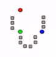

# K-Means Clustering

We're going to talk about k-means clustering and this is a unsupervised learning technique where you have a collection of stuff that you want to group together into various clusters. Maybe it's movie genres or demographics of people. Who knows, but it's actually a pretty simple idea. So let's go and see how it works. 
All right, let's talk about k-means clustering, very common, technique in machine learning where you just try to take a bunch of data and find interesting clusters of things, just based on the attributes of the data itself. Sounds fancy, but it's actually pretty simple. 

**K-Means Clustering**

-	Attempts to split data into K groups that are closest to K centroids
-	Unsupervised learning – uses only the position of each data point
-	Can uncover interesting groupings of people / things / behavior
-  -	Example: Where do millionaires live?
-  -	What genres of music / movies / etc. naturally fall out of data ? 
-  -	Create your own stereotypes from demographic data

All we do in k-means clustering is try to split our data into K groups. That's where the K comes from. Its how many different groups you're trying to split your data into? And it does this by finding K centroids. So basically what group of given data point belongs to is defined by which of these centroid points its closest to in your scatter plot, so you can visualize that over Here, 

 

this is showing an example of k-means clustering with K of 3 and the squares represent data points in a scatter. Plot, the circles represent the centroids that the k-means clustering algorithm came up with, and each point is assigned a cluster based on which centroid is closest to. Okay. So that's all there is to, it really is an example of unsupervised learning. So it's not a case where we have a bunch of data, and we already know the correct cluster for a given set of training data, rather. You're just given the data itself and it tries to converge on these clusters naturally, just based on the attributes of the data alone. So it's a good case of where you're trying to find clusters or categorizations that you didn't even know Were there. It's a as with most unsupervised learning techniques. The point is to find latent values, you know things you didn't really realize, were there until the algorithm show them to you. So for example, where did millionaires live? Maybe I don't know. Maybe there is some interesting geographical cluster, where you know, rich people tend to live and k-means clustering, could help you figure that out. Maybe. I don't really know if today's genres of music or meaningful. What does it mean to be alternative these days not much, right? But by using K means clustering, on attributes of songs, maybe I could find interesting clusters of songs that are related to each other and come up with new names for what those clusters represent, or maybe I can look at demographic data and maybe existing stereotypes are no longer useful. Maybe you know, Hispanic has lost its meaning and there's actually other attributes that Define groups of people. For example, that I could uncover with clustering 

**K-Means Clustering**
-	Actually how it works is really simple
- -	Randomly pick K centroids (k-means)
- -	Assign each data point to the centroid it’s closest to
- -	Recompute the centroids based on the average position of each centroid’s points
- -	lterate until points stop changing assignment to centroids
-	if you want to predict the cluster for new points, just find the centroid they’re closest to. 

So here's the algorithm, we start off with a randomly chosen set of centroids, So if we have a k of 3, we're going to look for three clusters in our group. And we will assign three randomly position centroids in our scatter plot. We then assign each data point, to the randomly assigned centroid, that is closest to, and then we compute the centroid for each cluster that we come up with. So, for a given cluster that we end up with, we will move that centroid to be the actual Center of all those points. And then we will do it all again until those centroid Stop moving we hit some threshold value that says, okay. We have converged on something here and then to predict the clusters for new points that I haven't seen before. We can just go through our centroid, locations and figure out which centroid is closest to predict its cluster.

 
let's look at a graphical example here to make a little bit more sense. So say I have a scatter plot again. 

 
These gray squares represent data points in our scatter plot. So axes represent some different features of something, maybe its age and income is in example I keep using, but it could be anything. And these squares might represent individual people, or individual songs or individual something that I want to find relationships between, okay. 
So I start off by just picking three points at random in my scatter plot. Could be anywhere got to start somewhere. Right? 

 
So the next thing I'm going to do is for each point. I'll compute the which one of these points it's closest to. So you can see where that ends up being by doing that. These points shaded in blue or associated with this blue centroid. The green points are closest to the green centroid. In this single red point is closest to that red, random point that I picked out, but you can see, you know, that's not really a reflective of where the actual clusters appear to be. So if I do this again, what I’m going to do is take the points that ended up in each cluster and compute the actual Center of those points. So for example, in this green cluster here, The actual Center of all that data turns out to be a little bit lower.

 
 So we're going to move that down a little bit in this red cluster. I only had one point so it's Center moves down to where that single point is. Okay, and the blue point was actually pretty close. So that just moves a little bit and on this next iteration:
 
 
 
we end up with something that looks like this. So now you can see that our cluster for red things has grown a little bit and things have moved a little bit with those got taken from the green cluster basically and if we do that again, you can probably see what's going to happen next. So that green centroids going to move over here. A little bit blue centroid is still about where it should be. But at the end of the day, you're going to end up with the Clusters. That's how K means works. So it just keeps iterating trying to find the right centroids until things stop moving around and we converge on a solution.

**K-Means Clustering Gotchas**
-	Choosing K
- -	Try increasing K values until you stop getting large reductions is squared error (distances from each point to their centroids)
-	Avoiding local minima
- -	The random choice of initial centroids can yield different results
- -	Run it a few times just to make sure your initial results aren’t wacky
-	Labeling the clusters 
- -	K-Means does not attempt to assign any meaning to the clusters you find
- -	It’s up to you to dig into the data and try to determine that

So there are obviously some limitations to k-means clustering. First of all, we need to choose the right value of K. And that's not a straightforward thing to do at all. You know, the way that the principled way of choosing K is to just start low and keep increasing the value of K. How many groups you want until you stop getting large? Reductions in squared error. So, you know, if you look at the distances from each point to their centroids, you can think of that as an error metric. And at the point where you stop reducing  that error metric, you know you probably have too many clusters? Okay, so you're not really gaining any more information by adding additional clusters at that point. 
Also, there is a problem of local Minima so you could just get very unlucky with those initial choices of centroids and we might end up just converging on local phenomena instead of more Global clusters. So usually you want to run this a few times and maybe average the results together, we call that Ensemble learning. We'll talk about that more a little bit later on. But, you know, it's always a good idea to run k-means more than once using a different set of random initial values and just see if you do in fact, end up with the same overall results or not. Finally, the main problem with k-means clustering is that there's no labels for the Clusters that you get. It will just tell you that this group of data points are somehow related, but you can't put a name on it, you know, you can't tell you the actual meaning of that cluster. Let's say I have a bunch of movies. I'm looking at and k-means clustering tells me that bunch of science, fiction movies are over here, but it's not going to call them science fiction movies for me. It's up to me to actually dig into the data and figure out. Well, what do these things really have in common? And how might I describe that in English. That's, that's the hard part and k-means won't help you with that. 
